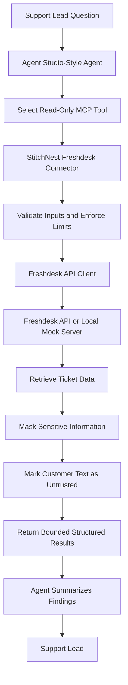

# StitchNest Helpdesk Connector

### A Read-Only Freshdesk MCP Server for Agent Studio-Style Support Agents

[](https://www.python.org/)
[](https://modelcontextprotocol.io/)
[](#security-and-guardrails)
[](#test-data-and-evaluation)

**Razorpay — Forward-Deployed Engineer, Agent Studio | Assignment 3**

A private, read-only Model Context Protocol (MCP) connector that enables an AI support agent to retrieve, search, and inspect Freshdesk tickets through a bounded, security-conscious tool interface.

**Repository:** [github.com/Pranavi0525/merchant_tool](https://github.com/Pranavi0525/merchant_tool)

---

## 1. Overview

StitchNest is a fictional Indian direct-to-consumer apparel brand that accepts payments through Razorpay.

Its customer support team handles issues involving failed UPI payments, refunds, payment debits without order confirmation, and delayed ticket resolution. Answering operational questions across support tickets can require manually filtering and reading individual records.

This project builds a private connector that exposes Freshdesk ticket data through MCP tools, allowing an Agent Studio-style AI agent to retrieve relevant information and summarize it for the support team.

For example, a support lead could ask:

- Which open tickets are related to payment failures?
- Which customers reported that money was debited but their orders were not confirmed?
- Which tickets mention refunds or failed UPI transactions?
- Which tickets are overdue or approaching their SLA deadline?
- What information is available in a particular ticket?

The connector retrieves the relevant records, applies output limits and best-effort PII masking, and marks customer-written text as untrusted content before returning the results to the agent.

**The central design principle is to expose useful business information without giving the agent permission to modify the merchant's helpdesk.**

## 2. Assignment requirements

This implementation addresses the requirements for Razorpay's third assignment: building a private connector for a merchant tool.

| Requirement         | Implementation                                                   |
| ------------------- | ---------------------------------------------------------------- |
| Merchant platform   | Freshdesk                                                        |
| Connector language  | Python                                                           |
| Agent integration   | MCP server using the official MCP SDK                            |
| Authentication      | Freshdesk API key through environment configuration              |
| List primitive      | `list_tickets`                                                   |
| Get primitive       | `get_ticket`                                                     |
| Search primitives   | `search_tickets`, `find_by_keyword`                              |
| Rate-limit handling | Retries for HTTP 429 and transient 502/503/504 errors            |
| Output control      | Bounded pages, descriptions, search scans and public messages    |
| Privacy safeguards  | Best-effort PII masking and untrusted-content handling           |
| Access boundaries   | Read-only tool surface                                           |
| Local evaluation    | Synthetic Freshdesk data and deterministic tool-level evaluation |
| Credentials         | No real credentials required for local mock-mode testing         |

## 3. Architecture



### Request lifecycle

1. The support lead asks a question about tickets.
2. The agent selects an appropriate read-only MCP tool.
3. The connector validates the requested parameters and applies configured limits.
4. The connector retrieves ticket data from Freshdesk or the local mock service.
5. The response is processed to reduce sensitive-data exposure and preserve the distinction between trusted metadata and untrusted customer text.
6. The agent uses the returned information to produce a concise answer.

The connector does not independently guarantee the correctness of an LLM's final response. Its responsibility is to provide a constrained, predictable interface to the underlying support data.

## 4. MCP tools

The connector exposes four ticket-retrieval primitives.

| Tool              | Purpose                                                        | Typical use                                                   |
| ----------------- | -------------------------------------------------------------- | ------------------------------------------------------------- |
| `list_tickets`    | Retrieve a bounded page of tickets                             | Review recent tickets or inspect ticket lists                 |
| `get_ticket`      | Retrieve details for a specific ticket                         | Examine an individual payment or refund complaint             |
| `search_tickets`  | Search tickets using the supported structured search criteria  | Narrow down tickets matching supported search conditions      |
| `find_by_keyword` | Find a literal keyword in a bounded set of recent ticket pages | Locate mentions of `refund`, `UPI`, `paisa`, or similar terms |

### Tool behaviour

**`list_tickets`**

Returns a bounded list of ticket records. Pagination and result limits prevent a single request from returning an unnecessarily large dataset.

**`get_ticket`**

Retrieves details for a specified ticket, subject to the connector's output limits and privacy processing.

**`search_tickets`**

Supports the search criteria implemented by the connector. It should not be interpreted as unrestricted semantic or natural-language search.

**`find_by_keyword`**

Scans a bounded number of recent ticket pages and performs substring matching. Its results depend on the keyword, the available ticket text, and the configured scan window.

For example, a ticket containing `paisa` may be found by searching for `paisa`; searching for `payment` will not necessarily find it.

> Exact tool parameter names, schemas, defaults, and validation rules should be taken from the implementation rather than inferred from these descriptions.

## 5. Security and guardrails

Security is part of the connector's interface design, not an assumption that the AI agent will always behave correctly.

### Read-only access

The connector exposes retrieval operations only. It contains no supported tool path for modifying Freshdesk records.

The agent cannot use this connector to:

- Create, edit, or delete tickets.
- Reply to customers.
- Assign tickets to agents.
- Change ticket status or close tickets.
- Add internal notes.
- Modify merchant helpdesk data.

This boundary limits the impact of an incorrect tool selection or an unexpected agent response.

### Bounded outputs

The connector applies configured limits to ticket pages, search pages, keyword-search depth, description length, and public messages returned for an individual ticket.

These controls reduce excessive responses, keep tool results manageable, and help control token consumption. The trade-off is that a single request cannot retrieve an unlimited amount of historical data.

### PII masking

Returned content undergoes best-effort masking of email addresses and removal of phone numbers and card-like numbers.

The current approach uses pattern-based redaction. It may miss unusual or previously unseen formats and should not be treated as a complete guarantee that all personal or financial information has been removed.

### Untrusted customer content

Customer-written ticket text may contain instructions intended to manipulate an AI agent.

The connector applies the following safeguards:

- Places customer-written text under an `untrusted_content` field.
- Adds warnings that distinguish customer content from trusted instructions.
- Removes zero-width, bidirectional, and control characters as implemented.
- Instructs the agent not to follow instructions embedded in ticket content.

These safeguards reduce risk but do not eliminate prompt injection. The consuming agent must continue to treat ticket text as data rather than as executable instructions.

### API-key handling

For a real Freshdesk account, the API key is supplied through environment configuration rather than hardcoded into source files.

Credentials must not be committed to Git, included in screenshots, or returned in tool results. Local evaluation can run using synthetic data without a real API key.

## 6. Technology stack

| Component               | Technology                      |
| ----------------------- | ------------------------------- |
| Implementation language | Python                          |
| Agent-tool interface    | Model Context Protocol (MCP)    |
| MCP implementation      | Official Python MCP SDK         |
| HTTP communication      | HTTPX                           |
| Local mock API          | FastAPI and Uvicorn             |
| Automated testing       | Pytest                          |
| Test fixtures           | Synthetic Freshdesk ticket data |

The dependencies are listed in [`requirements.txt`](requirements.txt).

## 7. Repository structure

```text
merchant_tool/
├── connector/       # Freshdesk MCP connector implementation
├── connectors/      # Connector-related modules
├── eval/            # Deterministic tool-level evaluation
├── fixtures/        # Synthetic ticket fixtures
├── mock_server/     # Local mock Freshdesk API
├── tests/           # Automated tests
├── .env.example     # Example environment configuration
├── .gitignore
├── pytest.ini
├── requirements.txt
├── run_mcp.cmd      # Windows MCP launch helper
└── README.md

```

This is a high-level guide to the repository. Refer to the source files for the exact module responsibilities and entry points.

## 8. Setup and local execution

### Prerequisites

- Python installed and available on your command line.
- Git.
- A terminal or command prompt.
- Internet access only if you need to install dependencies or connect to a real Freshdesk account.

A real Freshdesk account and API key are **not required for mock-mode evaluation**, provided the local mock service is running and configured correctly.

### Step 1: Clone the repository

```bash
git clone https://github.com/Pranavi0525/merchant_tool.git
cd merchant_tool

```

### Step 2: Create a virtual environment

**Windows — Command Prompt**

```bat
py -m venv .venv
.venv\Scripts\activate

```

If `py` is unavailable, use:

```bat
python -m venv .venv
.venv\Scripts\activate

```

**macOS/Linux**

```bash
python3 -m venv .venv
source .venv/bin/activate

```

### Step 3: Install dependencies

```bash
python -m pip install --upgrade pip
python -m pip install -r requirements.txt

```

### Step 4: Configure the environment

Copy the example configuration file.

**Windows — Command Prompt**

```bat
copy .env.example .env

```

**macOS/Linux**

```bash
cp .env.example .env

```

The example configuration uses the following variables:

```dotenv
FRESHDESK_API_KEY=test-key
# FRESHDESK_DOMAIN=yourcompany
# FRESHDESK_BASE_URL=http://127.0.0.1:8000

```

The mock server is the default target according to the example configuration. Check the connector's configuration code for the exact precedence and loading behaviour of these variables.

**Important:** Never replace the mock configuration with a real credential in a committed file. The `.env` file should remain untracked.

### Step 5: Start the mock Freshdesk service

Start the local mock service using the application entry point defined in `mock_server/`.

The mock API must be running at the configured base URL before the connector can retrieve data from it.

To identify the exact ASGI application path, inspect the Python file in `mock_server/` that defines the FastAPI application, then use its module path with Uvicorn:

```bash
python -m uvicorn <module_path>:<application_variable> --host 127.0.0.1 --port 8000

```

Replace the placeholders with the actual module and application variable names in the repository. Do not use this placeholder command unchanged.

### Step 6: Launch the MCP server

On Windows, use the provided launcher:

```bat
run_mcp.cmd

```

Alternatively, inspect `run_mcp.cmd` to identify the exact Python module it launches and run that command directly inside the activated virtual environment.

The MCP server uses **stdio transport**. Its standard input and output are reserved for MCP communication, so diagnostic logging should go to standard error rather than standard output.

### Step 7: Connect an MCP-compatible agent

Configure your MCP-compatible host to launch the connector using the repository's Python environment and the same environment variables.

A typical stdio host configuration has this shape:

```json
{
  "mcpServers": {
    "stitchnest-freshdesk": {
      "command": "C:\\path\\to\\merchant_tool\\.venv\\Scripts\\python.exe",
      "args": [
        "-m",
        "<module_from_run_mcp.cmd>"
      ],
      "env": {
        "FRESHDESK_API_KEY": "test-key",
        "FRESHDESK_BASE_URL": "http://127.0.0.1:8000"
      }
    }
  }
}

```

Replace the path and module placeholder with the actual values for your machine and launcher. This is an illustrative host configuration, not a claim that every MCP client uses an identical configuration format.

Once connected, inspect the discovered MCP tool list and call the read-only ticket tools using their declared schemas.

## 9. Running the automated tests

Activate the virtual environment and run:

```bash
python -m pytest

```

To display individual test names and outcomes:

```bash
python -m pytest -v

```

The repository's assignment checklist reports **20 automated tests** covering the connector's implemented behaviour.

For a meaningful evaluation, tests should exercise successful retrieval, invalid inputs, empty or long descriptions, output limits, PII masking, untrusted customer content, and transient API failures.

Use the actual test results from your current checkout when reporting whether all tests pass.

## 10. Test data and evaluation

### Synthetic Freshdesk dataset

The evaluation dataset contains **61 synthetic tickets**. It includes deliberately varied cases such as:

- Payment failures and refund requests.
- Failed UPI payments.
- Tickets with overdue SLA deadlines.
- Empty and long descriptions.
- Near-duplicate tickets.
- Hinglish text.
- Prompt-injection-style customer messages.
- Simulated rate-limit and transient-failure scenarios.

The data is fictional and does not require access to real merchant or customer records.

### Deterministic evaluation

The repository includes a 20-question, tool-level evaluation comparing a naive/raw connector interface with the agent-friendly connector.

The recorded evaluation results are:

| Metric                | Naive/raw interface | Agent-friendly connector |
| --------------------- | ------------------- | ------------------------ |
| Questions passed      | 15/20               | 20/20                    |
| Estimated token usage | Baseline            | Approximately 58% lower  |

The token reduction is an estimate from the scripted evaluation, not a measurement of production LLM usage.

### What these results establish

The evaluation provides evidence about the tested tool interface and its ability to retrieve and expose the expected information from the synthetic dataset.

It does **not** establish:

- LLM reasoning accuracy.
- LLM tool-selection accuracy.
- Natural-language response quality.
- Hallucination rates.
- Performance on real merchant data.
- Production latency or reliability.

The results should therefore be interpreted as a deterministic interface evaluation, not as an LLM benchmark.

## 11. What the agent can and cannot do

| Capability                                        | Supported behaviour                                                  |
| ------------------------------------------------- | -------------------------------------------------------------------- |
| Retrieve tickets                                  | Yes, within configured limits                                        |
| Inspect an individual ticket                      | Yes                                                                  |
| Search supported ticket fields                    | Yes, within implemented search behaviour                             |
| Find literal keywords                             | Yes, within the bounded scan window                                  |
| Identify payment-related complaints               | The agent can retrieve matching records and summarize their contents |
| Review refund and UPI issues                      | The agent can retrieve matching records and summarize their contents |
| Inspect SLA-related ticket information            | Yes, where the required fields are available                         |
| Retrieve unlimited ticket history                 | No                                                                   |
| Perform semantic search or synonym expansion      | Not guaranteed                                                       |
| Translate between languages                       | No                                                                   |
| Update or close tickets                           | No                                                                   |
| Reply to customers                                | No                                                                   |
| Guarantee complete PII removal                    | No                                                                   |
| Guarantee immunity to prompt injection            | No                                                                   |
| Maintain a continuously synchronized ticket index | No                                                                   |

The agent's conclusions are limited by the underlying data, implemented search behaviour, API availability, and the reliability of the consuming model.

## 12. Limitations and production considerations

This implementation is scoped as a take-home assignment. The following constraints should be considered before production deployment.

### Bounded keyword search

`find_by_keyword` scans a configured number of recent ticket pages and uses substring matching. It can miss older tickets and does not provide semantic matching, synonym expansion, or cross-language search.

**Possible next step:** Add an indexed search layer using PostgreSQL full-text search or Elasticsearch/OpenSearch, with embeddings if semantic retrieval is required.

### Best-effort PII redaction

Regex-based masking cannot reliably identify every sensitive value or every possible formatting variation.

**Possible next step:** Use explicit field allow-lists, structured sensitive-data handling, output validation, and additional privacy tests.

### Prompt-injection risk

Separating customer content from trusted instructions helps, but formatting and sanitization alone cannot guarantee that the consuming model will ignore malicious text.

**Possible next step:** Add application-level policy enforcement, structured tool outputs, adversarial evaluations, and least-privilege controls in the agent runtime.

### Single-merchant authentication

The connector uses an API key configured for one merchant environment. It is not a complete multi-tenant credential-management service.

**Possible next step:** Add per-merchant secret isolation, credential rotation, tenant-specific authorization, access policies, and audit logging.

### Rate limits and transient failures

The connector retries HTTP 429 and transient HTTP 502, 503, and 504 responses using bounded retry logic and respects `Retry-After` when available.

Actual limits and response behaviour depend on the Freshdesk account and plan.

**Possible next step:** Validate the implementation against the target account, monitor retry behaviour, and introduce operational metrics and alerting.

### Freshness and SLA calculations

The connector retrieves data on demand and does not maintain a continuously synchronized local database. Overdue status is calculated at request time.

**Possible next step:** Introduce webhook-driven synchronization and a persistent index if historical search, frequent queries, or continuously monitored SLA state becomes necessary.

### Mock/API compatibility

The local mock service enables deterministic tests but is not a complete replica of every Freshdesk account, API response, or plan-specific restriction.

**Possible next step:** Run controlled integration tests against an authorized Freshdesk account before production deployment.

## 13. Assumptions

1. The merchant has a Freshdesk account and an API key authorized to read the required ticket data when real-account mode is used.
2. The connector is launched by a trusted MCP-compatible agent host.
3. Ticket text is untrusted data, regardless of whether it contains instructions.
4. Read-only access is sufficient for the assignment.
5. Credentials are supplied through environment configuration and never committed.
6. Synthetic tickets are sufficient for deterministic local evaluation.
7. The agent may make multiple tool calls when one request requires additional details.
8. Bounded output and search limits are intentional trade-offs.
9. Production use would require additional monitoring, credential management, access controls, and integration validation.

## 14. Running without real credentials

The repository is designed to support local evaluation with synthetic data.

For mock-mode execution:

1. Clone the repository.
2. Create and activate a Python virtual environment.
3. Install the requirements.
4. Copy `.env.example` to `.env`.
5. Start the mock API using its actual application entry point.
6. Launch the MCP server.
7. Connect an MCP-compatible host or run the automated tests.

No real customer data is needed for this workflow. Ensure that the connector is pointed at the local mock service rather than a real Freshdesk account before using placeholder credentials.

## 15. Assignment scope and implementation boundaries

This project implements the connector layer between a support agent and Freshdesk. It is not a complete customer-support automation platform.

The implementation focuses on:

- Exposing useful ticket-retrieval primitives through MCP.
- Restricting the agent to read-only operations.
- Limiting the volume of data returned.
- Applying best-effort privacy safeguards.
- Treating customer-authored content as untrusted.
- Handling selected transient API failures.
- Evaluating retrieval behaviour with synthetic data.

It does not implement automatic ticket resolution, payment processing, refund execution, ticket updates, or a production multi-tenant control plane.

## 16. Further improvements

Potential follow-on work includes:

- Integration testing against an authorized Freshdesk account.
- Stronger structured PII controls and redaction tests.
- Search indexing for broader historical and semantic retrieval.
- Per-merchant credentials and tenant isolation.
- Observability for latency, API errors, retries, and tool usage.
- Adversarial prompt-injection testing.
- An end-to-end evaluation using a real MCP host and a model, with tool-selection accuracy, answer correctness, and token usage measured separately.

These are proposed improvements, not capabilities claimed by the current implementation.

## 17. References

- [Repository](https://github.com/Pranavi0525/merchant_tool)
- [Model Context Protocol documentation](https://modelcontextprotocol.io/)
- [Freshdesk API documentation](https://developers.freshdesk.com/api/)
- [Python documentation](https://docs.python.org/3/)
- [Pytest documentation](https://docs.pytest.org/)

---

**Assignment:** Razorpay Forward-Deployed Engineer, Agent Studio — Assignment 3: Build a Private Connector for a Merchant Tool.

**Project:** StitchNest Helpdesk Connector
**Merchant tool:** Freshdesk
**Transport:** MCP over stdio
**Access model:** Read-only
**Evaluation data:** Synthetic tickets only
